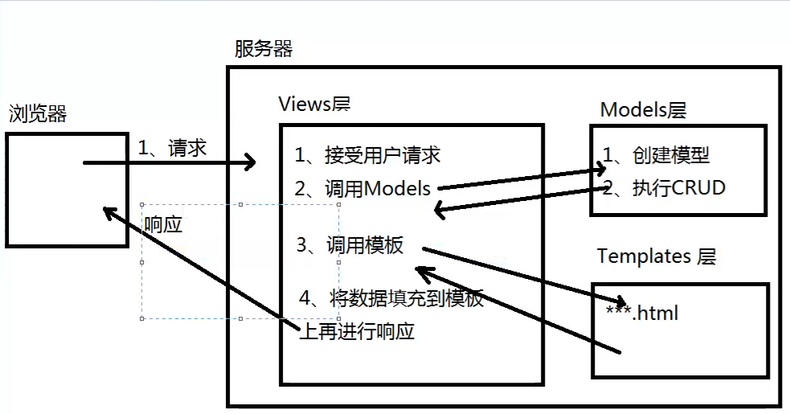
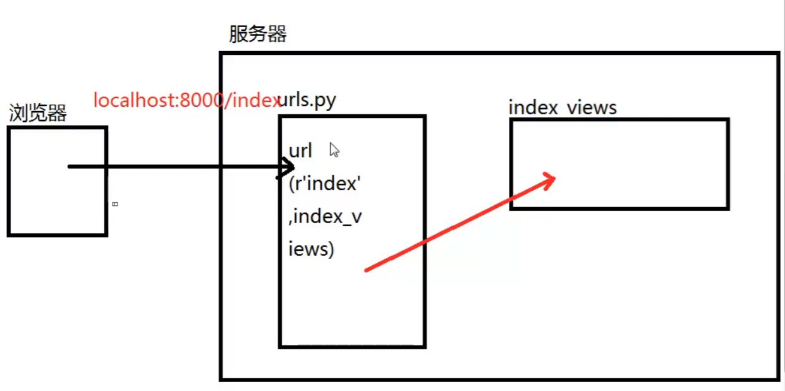

# Django
## 一、 Django的框架模式 - MTV

M: Models 层
    负责数据库的建模以及 CRUD操作
T: Templates 层
    用于处理用户显示的内容 如  HTML
V: Views 层
    处理用户交互操作，从模板中取得数据，再将数据发送给模板，并显示给用户


## 二、 Django 的使用

### 1.目录结构介绍

- 主目录（名称和项目名相同）
    - __init__.py 项目初始化文件，每当服务器启动的时候，都会自动执行
    - urls.py :项目的基础url 配置文件
    - wsgi.py：应用服务器配置文件
    - setting.py：项目的主设置文件
### 2.启动服务
```shell script
python  manage.py runserver
```
manage.py   负责执行Django中的各项操作文件
    - 启动服务
        - 创建管理员
        - 创建应用
        - 数据库的同步操作

## 三、URL的使用

    1. urls.py：默认是在主目录中，主路由配置文件包含最基本的地址映射，每个请求到达之后都由urls.py 中的
    urlpatterns 列表中的url()进行匹配
    url() 函数匹配上 之后，可能将请求转交给其他urls.py 或者 试图（Views）去处理
 
    url()函数语法：
        url(regex,views,kwargs=None,name=None)
        正则表达式：匹配请求的url
        视图处理函数或者其他的urls.py
        字典，用来给views 传参，没有参数可以省略
        字符串，给url()起别名，主要在模板中使用
        
##　四、应用的结构组成

    1. migrations 目录：存放数据库中间文件（日志文件）
    2. __init__.py：应用的初始化文件
    3. admin.py：应用的后台管理配置文件
    4. apps.py：应用的属性配置文件
    5. models.py：模型文件，与数据库有关
    6. test.py：测试模块
    7. views.py：定义视图的文件

​    

## 五、数据三大特征

1. 数据表 到 类 的映射，将数据表自动生成 一个 class 类 同时也允许将一个 class类自动生成数据库中的一张表
2. 数据类型的映射    允许将表中的字段的数据类型 自动 映射成编程语言中对应的数据类型    也允许 将编程语言的数据类型 自动 映射 成表中的字段的数据类型
3. 关系映射    在编程语言中允许将表与表之间的关系映射出来    表与表之间的关系也可以自动映射到编程语言的Class中4. 编写 Models    - Models 中的每个class 都称为 模型类 实体类    - Models 中的每个模型类，必须继承 models.Model

### 模型 字段类型 和 字段选项

- 字段类型（Field Type）

  - BooleanField() 
  - CharField() 
  - DateField()    
  - DateField()    
  - DateTimeField()   
  - DecimalField()   
  - EmailField() # 存电子邮件 - varchar    
  - FloatField()    
  -  ImageField(upload_to='') # 存图片路径 - varchar    
  - IntergerField()    
  - URLField()    
  - TextField() # 存大量文本数据 - text

- ### 字段选项（Field Option）

  - ### max_length # 在 CharField() 必须设置选项 

  - ### default 

  - ###  null # 指定当前字段是否允许为空，默认值 false

- 数据模型的版本切换

  ```shell
  ./manage.py migrate										 # 执行所有应用中最新的数据库中间文件
  ./manage.py migrate 应用名称 版本号	# 执行 应用中版本号对应的中间文件
  ./manage.py inspectdb > 文件名.py		  # 通过数据库自动导出 Models
  ```

  

## 六、连接 MySQL

- 环境按照

  ```shell
  sudo apt-get install python3-dev
  sudo apt-get install python3-dev libmysqlclient-dev
  pip install mysqlclient
  ```

- 项目配置

  ```pyth
  DATABASES = {
      'default': {
          'ENGINE': 'django.db.backends.mysql',
          'HOST': '127.0.0.1',
          'PORT': '3306',
          'USER': 'root',
          'PASSWORD': 'root',
          'NAME': 'django',
          'OPTIONS': {
              'init_command': "SET sql_mode='STRICT_TRANS_TABLES'",
              'charset': 'utf8mb4',
          },
      }
  }
  ```


## 七、模型中的 CRUD

#### 1.通过 ORM 向 DB 中添加数据

1. Entry.objects.create(属性=值，......)	

    Entry：具体要操作的Model类

   ```python
   Author.objects.create(name='张三',age='20')
   ```

2. 创建一个Models对象，通过对象save() 完成

   ```python
   obj = Author(name='张三',age='20')
   obj.save()
   ```

3. 使用 字典序 构建对象，通过save() 完成增加

   ````python
   dic = {
       '属性1': '值1',
        '属性1': '值1',
   }
   obj = Entry(**dic)
   obj.save()
   ````

#### 2.查询操作（重难点）[查询](https://docs.djangoproject.com/en/2.2/ref/models/querysets/)

1. 通过Entry.objects 调用方法
   1. 基本查询操作
      - all()
   
2. 查询指定列
   
   1. value()
   
3. 排序函数
   
   1. order_by()
   
4. 对条件取反
   
   1. exclude()
   
5. 根据条件查询部分行数据 ==重难点==
   1. 使用Entry 中的属性作为查询参数，多个参数，用 ， 隔开 映射到SQL 语句上是用 and 进行关联的
      
      1. filter()
      
   2. 通过 [Field Lookup](https://docs.djangoproject.com/en/2.2/ref/models/querysets/#id4)(查询表达式)完成复杂条件查询（这里有点像 QueryDSL，各种方法，但是按照SQL的思维来就可以了，只不过稍微要注意用法，直接去官网查询即可）
   
      ​	查询表达式：每个查询表达式都是一个独立的查询条件，可以用在所有查询条件的位置处
   
      1. __exact：精确查询，等值判断
   
         ```python
         User.objects.filter(id__exact=1)
         select * from user where id = 1
         ```
   
      2. __contains()：筛选出属性中包含指定关键字的记录（模糊查询）
   
         ```python
         User.objects.filter(name__contains='jun')
         select * from user where name like '%jun%'
         ```
   
      3. __lt：筛选出属性值小于指定值的记录
   
      4. __lte：筛选出属性值小于等于指定值的记录
   
      5. __gt：筛选出属性值大于指定值的记录
   
      6. __gte：筛选出属性值大于等于指定值记录
   
      7. __startswith:
   
      8. __endswith:
   
6. 查询只返回一条数据

   Entry.objects.get(查询条件/表达式)

#### 3. 修改数据

 1. 修改单个数据（这里可以类比 JAP里的对单个实体进行操作，先拿再改最后存）

     	1. 通过　get() 得到要修改的实体对象
          	2. 通过实体对象的属性修改属性值
               	3. 再通过 实体对象的save() 保存回数据库

 2. 批量修改数据（这个意义不是太大）

    Entry.objects.all().update(属性=值，属性=值)

    update  user set 属性=值, 属性=值 

#### 4. 删除数据

```python
User.objects.get(id=1).delete()
```


## 八、安全

### 1. CSRF 跨站处理


