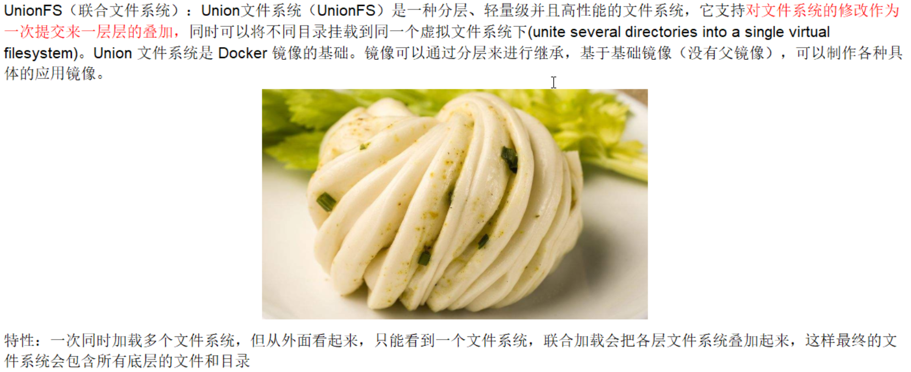
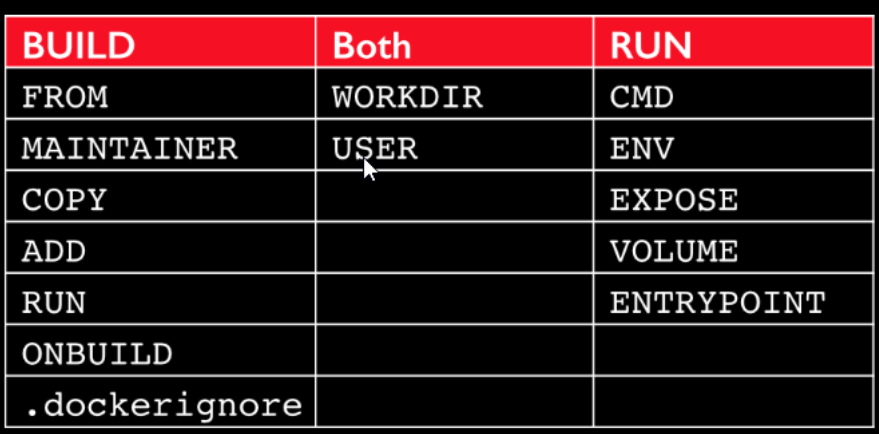
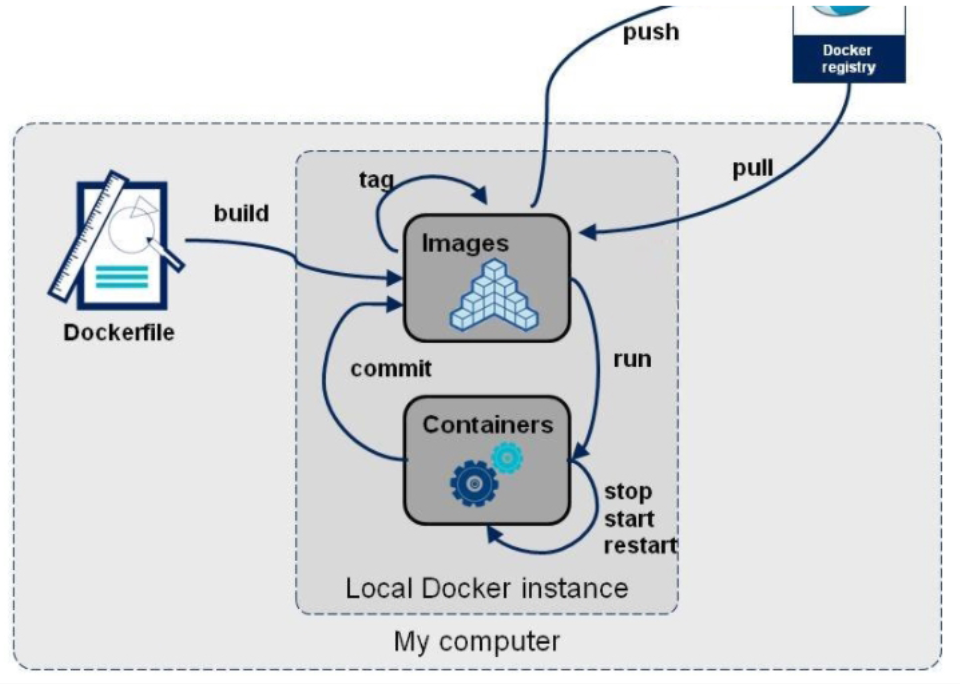
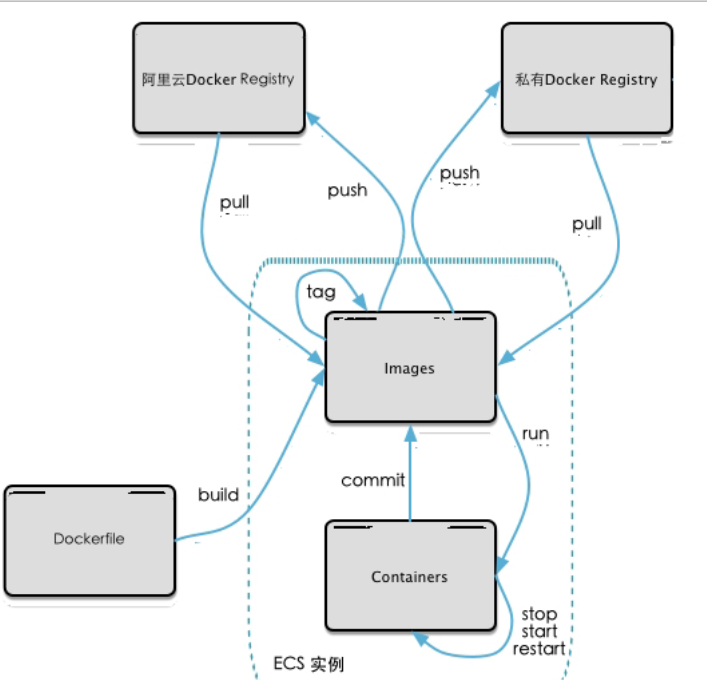

@[TOC](目录)
# Docker 笔记
## 一、Docker 简介
- 是什么：
    - 一次封装，多处运行，解决运行环境和配置问题软件容器，方便做持续集成并有助于整体发布的容器虚拟化技术
- 能干嘛：
    - 之前的虚拟机技术
    - 容器虚拟化技术
    - 开发/运维（DevOps）：开发自运维
        - 更快速的应用交付和部署
        - 更快速的升级 和 扩缩容
        - 更快速的系统运维
        - 更高效的计算资源利用
    - 企业级
- 去哪下
## 二、Docker 安装
- Docker基本组成
    - 镜像image
    - 容器 container：用镜像创建的运行实例
    - 仓库 repository
## 三、Docker常用命令
```shell script
$ docker run -it images_name
```
- 运行Ubuntu
```shell script
    $ docker run -it -v /myDataVolume:/dataVolumeContainer ubuntu
    $ docker start 3af88b62bae9
    $ docker attach 3af88b62bae9
```

## 四、Docker镜像
- 是什么
    - Docker镜像加载原理
        - docker的镜像实际上由一层层的文件系统组成，这种层级的文件系统 UnionFS
        - bootfs（boot file system）只要包含bootloader和kernel，bootloader主要是引导加载kernel，Linux刚启动时会加载bootfs文件系统，
        在Docker镜像的最底层是bootfs。这一层和Linux/Unix系统是一样的，包含boot加载器和内核。当boot加载完成之后整个内核就都在内存中了，
        此时内存的使用权已由bootfs转交给内核，此时系统也会卸载bootfs。
        - rootfs（root file system）在bootfs之上，包含的就是经典Linux系统中的/dev /proc /bin /etc等标准目录和文件。rootfs就是各种不同
        的操作系统发行版本，如Ubuntu、CentOS等等
        
        - 最大的好处： 共享资源
            有多个镜像都是从同一个base镜像构建，那么宿主机只要在磁盘上保存一份base镜像，同时内存中也只要加载一份base镜像，就可以给所有容器服务了。
            而且镜像的每一层都可以共享
- 特点
    Docker镜像都是只读的，当容器启动时，一个新的可写层被加载到镜像的顶部。这一层通常被称作“容器层”,容器层之下的都是“镜像层”。
## 五、Docker 容器数据卷（Docker容器中的数据持久化（保存下来））
- 背景：
    - 将运用与运行的环境打包成容器运行，运行可以伴随容器，但是我们对数据的要求希望是持久化的
    - 容器之间希望有可能共享数据
    Docker容器产生的数据，如果不通过docker commit 生成新的镜像，使得数据做成镜像的一部分保存下来，那么容器删除后数据就没了
    为了能保存数据在docker中使用 数据卷（类似Redis中的 rdb和aof文件）
- 能干嘛
      卷就是目录或文件，存在于一个或多个容器中，由docker挂载到容器，但不属于UnionFS，因此能绕过UnionFS提供一些用于持久储存或共享数据的特性，
      卷的设计目的就是数据的持久化，完全独立于容器的生存周期，因此Docker不会在容器删除时删除其挂载的数据卷
      - 特点
        1. 数据卷可在容器之间共享或重用数据
        2. 卷中的更改可以直接生效
        3. 卷中的更改不会包含在镜像的更新中
        4. 卷的生命周期一直持续到没有容器使用为止 
- 数据卷
    - 容器添加
        - 直接命令添加
            1. 命令
                docker run -it -v /myDataVolume:/dataVolumeContainer ubuntu
            2. 查看数据卷是否挂载成功
                docker inspect 3af88b62bae9 （CONTAINER ID）
                ```json
                    "HostConfig": {
                        "Binds": [
                            "/myDataVolume:/dataVolumeContainer"
                        ]
                    }
                ```
            3. 容器和宿主机之间数据共享
            4. 容器停止退出后，主机修改后数据是否同步
                    $ docker start 3af88b62bae9
                    $ docker attach 3af88b62bae9
            5. 命令（带权限）
                docker run -it -v /myDataVolume:/dataVolumeContainer 镜像名 
                docker run -it -v /宿主机绝对路径目录:/容器内目录:ro      镜像名
                    - ro read-only 只读
        - DockerFile添加
            - 根目录下新建 my_docker 文件夹 并 进入
            - 在 Dockerfile 中使用 VOLUME命令 来给镜像添加一个或多个数据卷
                ```text
                  说明：
                    出于可移植和分享的考虑，用 -v 主机目录:容器目录 这种方法 不能直接在Dockerfile中实现
                    由于宿主机目录是依赖特定宿主机的，并不能保证在所有宿主机上都存在这样的特定目录
                ```
            - File 构建
            ```shell script
            docker run -it -v /host1:/dataVolumeContainer1 -v /host2:/dataVolumeContainer2 ubuntu /bin/bash
          
            # volume test
            FROM ubuntu
            VOLUME ["/dataVolumeContainer1","/dataVolumeContainer2"]
            CMD echo "finished,--------------success"
            CMD /bin/bash
            ```
            - build后生成镜像
            ```shell script
          $ docker build -f ./Dockerfile -t dockder_file/ubuntu .
          
          Sending build context to Docker daemon  17.92kB
          Step 1/4 : FROM ubuntu
           ---> 775349758637
          Step 2/4 : VOLUME ["/dataVolumeContainer1","/dataVolumeContainer2"]
           ---> Running in 7c7ad759b784
          Removing intermediate container 7c7ad759b784
           ---> 0af71e73f90a
          Step 3/4 : CMD echo "finished,--------------success"
           ---> Running in 20b46d5d6917
          Removing intermediate container 20b46d5d6917
           ---> 0ed798ff540c
          Step 4/4 : CMD /bin/bash
           ---> Running in 99f343a2a2df
          Removing intermediate container 99f343a2a2df
           ---> 6199b6ca4626
          Successfully built 6199b6ca4626
          Successfully tagged dockder_file/ubuntu:latest
            ```
            - run 容器 
            ```shell script
          docker run -it dockder_file/ubuntu /bin/bash
            ```
            - 主机对应默认地址：/var/lib/docker/volumes/ 下
        - 备注
- 数据卷容器
    - 是什么
        命名的容器挂载数据卷，其他容器通过挂载这个（父容器）实现数据共享，挂载数据卷的容器，叫做数据卷容器
        说白了，活动硬盘上挂载活动硬盘，实现数据传递
    - 总体介绍
    - 容器间传递共享   --volumes-from
        1. 先启动一个父容器 dc01
            ```shell script
           docker run -it --name dc01 dockder_file/ubuntu
            ```         
        2. dc02/dc03 继承 dc01    
            ```shell script
           docker run -it --name dc02 --volumes-from dc01 dockder_file/ubuntu
            ```   
        3. 回到dc01 可以看到02/03各自添加的都能共享了
            ```shell script
           docker run -it --name dc01 dockder_file/ubuntu
            ```
        4. 删除 dc01，dc02修改后是否可以访问
            ```shell script
           docker run -it --name dc01 dockder_file/ubuntu
            ```
        5. 删除dc02 后dc03是否可以访问
            ```shell script
           docker run -it --name dc01 dockder_file/ubuntu
            ```
        6. 新建dc04继承dc03 后在删除dc03
            ```shell script
           docker run -it --name dc01 dockder_file/ubuntu
            ```
        7. 结论： 容器之间配置信息的传递，数据卷的生命周期一直持续到没有容器使用它为止（即一旦容器创建后，它的信息传递的关系，不再受别的任何容器影响）
            
## 六、DockerFile解析
- 是什么
    - Dockerfile是用来构建Docker镜像的构建文件，是由一系列命令和参数构成的脚本
    - 构建三步骤
        1. 编写Dockerfile
        2. docker build
        3. docker run
    - 文件什么样
- Dockerfile创建过程
    - Dockerfile 内容基础知识
        1. 每条保留指令都必须为大写字母且后面要跟随至少一个参数
        2. 指令按照从上到下，顺序执行
        3. #表示注释
        4. 每条指令都会创建一个新的镜像层，并对镜像进行提交
    - Docker 执行 Dockerfile 大致流程
        1. docker 从基础镜像运行一个容器
        2. 执行一条指令并对容器做出修改
        3. 执行类似docker commit 的操作提交一个新的镜像层
        4. docker 再基于刚提交的镜像运行一个新的容器
        5. 执行Dockerfile 中的下一条指令直到所有指令都执行完成
    - 小总结
        1. Dockerfile，需要定义一个Dockerfile，Dockerfile定义了进程中需要的一切东西
        。Dockerfile涉及的内容包括执行代码或者文件、环境变量、依赖包、运行环境、动态链接库、操作系统的发行版、服务进程和内核进程
        （当应用进程需要和服务系统和内核进程打交道，这时要考虑如何设计namespace的权限控制）等等。
        2. Docker镜像，在用Dockerfile定义一个文件之后，docker build时会产生一个Docker镜像，当运行Docker镜像时，会真正开始提供服务
        3. Docker容器，容器是直接提供服务的
        从应用软件的角度看，Dockerfile、Docker镜像、Docker容器 分别代表 三个阶段
            Dockerfile是软件原材料
            Docker镜像是软件交付品
            Docker容器是软件运行状态
- Dockerfile 体系结构（保留字指令）
    - FROM：基础镜像，当前镜像是基于哪个镜像的
    - MAINTAINER：镜像维护者的姓名和邮箱地址
    - RUN：容器构建时需要运行的命令
    - EXPOSE：当前容器对外暴露的端口号
    - WORKDIR：指定在创建容器后，终端默认登陆的进来工作目录，一个落脚点
    - ENV：用来在构建镜像过程中设置环境变量
        ENV MY_PATH /usr/mytest
        这个环境变量可以在后面的任何 RUN 指令中使用，这就是如同在命令前面指定了环境变量前缀一样；也可以在其他指令中直接使用这些环境变量
    - ADD：将宿主机目录下的文件拷贝进镜像且ADD命令会自动处理 URL 和 解压tar压缩包
    - COPY：类似 ADD，拷贝文件和目录到镜像中。将从构建上下文目录中 <原路径> 的文件/目录复制到新的一层的镜像内的 <目标路径> 位置
    - VOLUME：容器数据卷，用于数据保存和持久化工作
    - CMD：指定一个容器启动时要运行的命令，Dockerfile中可以有多个CMD指令，但只有最后一个生效，CMD被 docker run 之后的参数替换
        CMD 容器启动命令
            CMD 和 RUN 格式类似，也是两种格式
                - shell 格式：CMD <命令>
                - exec 格式：CMD ["可执行文件","参数1","参数2"......]
                - 参数列表格式：CMD ["参数1","参数2"......]。在指定了 ENTRYPOINT 指令后，用 CMD 指定具体参数
    - ENTRYPOINT：指定一个容器启动时要运行的命令，ENTRYPOINT 的目的和 CMD一样，都是在指定容器启动程序及参数
    - ONBUILD：当构建一个被继承的 Dockerfile时运行命令，父镜像在被子继承后父镜像的 onbuild 被触发
    
- 案例
    - Base镜像（scratch）
        Docker Hub 中 99% 的镜像都是通过 在 base 镜像中安装 和 配置需要的软件构建出来的
    - 自定义镜像 myCentOS
    ```shell script
      FROM centos
      MAINTAINER Jun<wjxajh@gmail.com>
      
      ENV MYPATH /usr/local
      WORKDIR $MYPATH
      
      RUN yum -y install vim 
      RUN yum -y install net-tools
      
      EXPOSE 80
      
      CMD echo $MYPATH
      CMD echo "success --------------------- ok"
      CMD echo /bin/bash
    ```
    - CMD/ENTRYPOINT 镜像案例
    - 自定义镜像 Tomcat9
- 小总结

## 七、Docker常用安装
- 总体步骤
- 安装 tomcat
- 安装 MySQL
    ```shell script
  docker run -p 3306:3306 --name local_mysql 
  -v /opt/mysql/conf:/etc/mysql/conf 
  -v /opt/mysql/logs:/logs 
  -v /opt/mysql/data:/var/lib/mysql 
  -e MYSQL_ROOT_PASSWORD=root 
  -d mysql:5.7
    ```
  和 MySQL进行交互
  ```shell script
  docker exec -it 2a95e24f4184 /bin/bash
  ```
  导出数据库数据到数据卷
  ```shell script
  exec mysqldump --all-databases -uroot -proot > /logs/all-databases.sql
  ```
- 安装 redis
```shell script
docker run -p 6379:6379 --name redis_01
-v /opt/redis/data:/redis/data 
-v /opt/redis/conf:/usr/local/etc/redis/redis.conf 
-d redis 
redis-server 
/usr/local/etc/redis/redis.conf 
--appendonly yes
```          
```shell script
docker exec -it feed1bbcfc7d redis-cli
```
## 八、本地镜像发布到阿里云 [阿里云开发者平台](https://dev.aliyun.com/search.html)
- 本地镜像发布到阿里云流程
          
- 镜像的生成方法
    1. Dockerfile
    2. 从容器创建一个新的镜像
    ```shell script
   docker commit [OPTIONS]  容器ID [REPOSITORY[:TAG]]] 
    docker commit -a Jun -m "commit demo" 2a95e24f4184 mysql:1.0
    ```
- 将本地镜像推送到阿里云
    1. 本地镜像素材原型
    2. 阿里云开发者平台
        [阿里云开发者平台](https://dev.aliyun.com/search.html)
    3. 创建仓库镜像
        - 命名空间
        - 仓库名称
    4. 将镜像推送到registry
    5. 公有云可以查询到
    6.查看详情
- 将阿里云的镜像下载到本地
