# 并发 与 高并发
## 基本概念
并发：
    同时拥有两个或者多个线程，如果程序在单核处理器上运行，多个线程将交替地换入或换出内存，
    这些线程是同时存在，每个线程都处于执行过程的某种状态，如果运行在多核处理器上，
    此时，程序汇总的每个线程都将分配到一个处理器核上，因此可以同时运行
并发：
    多个线程操作相同的资源，保证线程安全，合理使用资源
高并发：
    服务能同时处理很多请求，提高程序性能
## 一、并发基础
- CPU多级缓存
    为什么需要CPU cache：CPU的频率太快，主内存跟不上，这样在处理器时针周期内，CPU常常需要等待主内存，浪费资源，
    所以出现cache，==是为了缓解CPU和内存之间速度的不匹配问题==（CPU -> cache -> memory）
- CPU cache 意义：
    - 时间局部性：如果某个数据被访问，那么在不久的时候很可能被再次访问
    - 空间局部性：如果某个数据被访问，那么它相邻的数据很快也可能被访问
- CPU 多级缓存一致性（MESI）：用于保证多个CPU cache之间缓存共享数据的一致
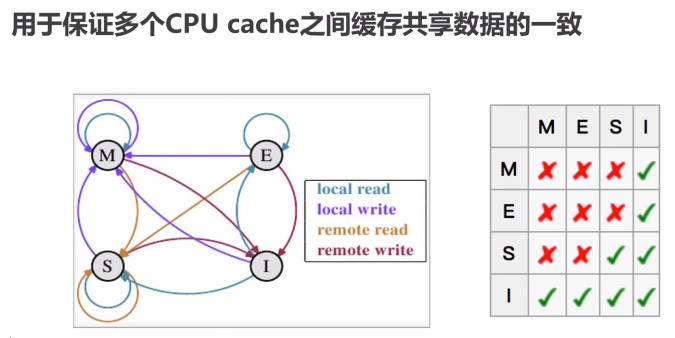
- CPU 多级缓存 - 乱序执行优化：处理器为了提高运算速度而做出违背代码原有顺序的优化

- Java内存模型（Java Memory Model, JMM）
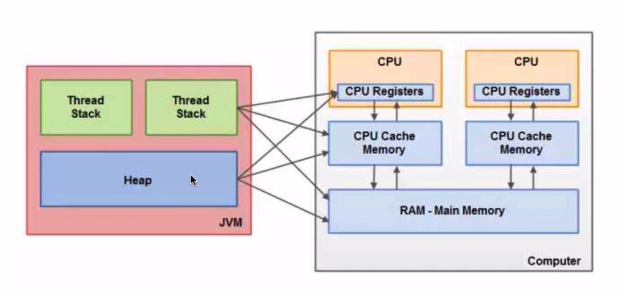
    - Java 内存模型抽象结构图
        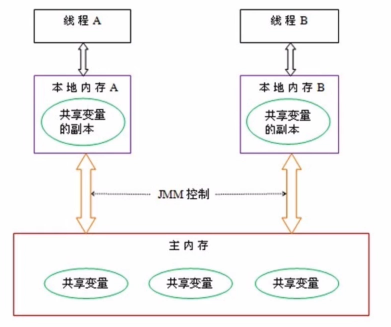
- Java内存模型 - 同步八种操作
    - lock（锁定）：作用于主内存的变量，把一个变量标识为一条线程独占状态
    - unlock（解锁）：作用于主内存的变量，把一个处于锁定状态的变量释放出来，释放后的变量才可以被其他线程锁定
    - read（读取）：作用于主内存的变量，把一个变量值从一个主内存传输到线程的工作内存中，以便随后的load动作使用
    - load（载入）：作用于工作内存的变量，它把read操作从主内存中得到的变量值放入工作内存的变量副本中
    - use（使用）：作用于工作内存的变量，把工作内存中的一个变量值传递给执行引擎
    - assign（赋值）：作用于工作内存的变量，它把一个从执行引擎收到的值赋值给工作内存的变量
    - store（存储）：作用于主内存的变量，它把store操作从工作内存中一个变量的值传送到主内存的变量中
    
- Java内存模型 - 同步规则
    - 如果要把一个变量从主内存中复制到工作内存，就需要按顺序地执行read和load操作，如果把变量从工作内存中同步回主内存中，就要按顺序地执行store和write操作。
    但Java内存模型只要求上述操作必须按顺序执行，而没有保证必须是连续执行
    - 不允许 read和load、store和write操作之一单独出现
    - 不允许一个线程丢弃它的最近assign的操作，即变量在工作内存中改变了之后必须同步到主内存中
    - 不允许一个线程无原因地（没有发生过任何assign操作）把数据从工作内存同步回主内存
    - 一个新的变量只能在主内存中诞生，不允许在工作内存中直接使用一个未被初始化（load或assign）的变量。即就是对一个变量实施use和store操作之前，必须先执行过了assign和load操作
    - 一个变量在同一时刻只运行一条线程对其进行lock操作，但lock操作 可以被同一条线程重复执行多次，多次执行lock后，只有执行相同次数的unlock操作，变量才会被解锁，lock和unlock必须成对出现
    - 如果对一个变量执行lock操作，将会清空工作内存中此变量的值，在执行引擎使用这个变量前需要重新执行load或assign操作初始化变量的值
    - 如果一个变量事先没有被lock操作锁定，则不允许对它执行unlock操作，也不允许去unlock一个被其他线程锁定的变量
    - 对一个变量执行unlock操作前，必须先把此变量同步到主内存中（store和Write操作）
    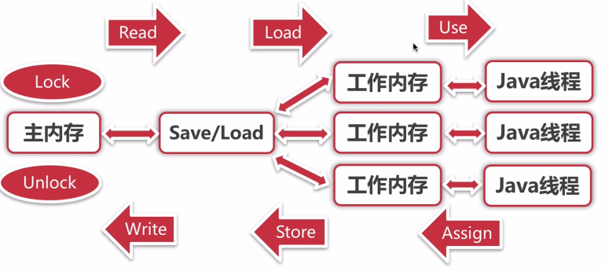

- 并发的优势与风险
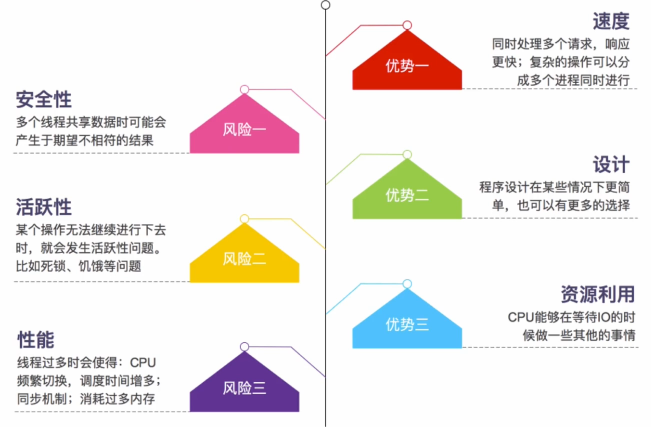
- 总结
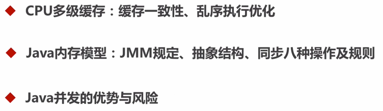

## 二、线程安全性
- 线程安全性：
    当多个线程访问某个类时，不管运行环境采用何种调度方式或者这些进程将如何交替执行
    ，并且在主调代码中不需要任何额外的同步或协同，这个类都能表现出正确的行为，那么就称这个类是线程安全的
- 三个特点：
    - 原子性：提供了互斥访问，同一时刻只能有一个线程来对它进行操作
        - Atomic 包
            - AtomicXXX：CAS、unsafe.compareAndSwapInt
            - AtomicLong 和 LongAdder（这两个之间的对比）
            - AtomicReference、AtomicReferenceFieldUpdater
            - AtomicStampReference：CAS的ABA问题
    - 可见性：一个线程对主内存修改可以及时的被其他线程观察到
    - 有序性：一个线程观察其他线程中的指令执行顺序，由于指令 重排序的存在，该观察结果一般杂乱无序
- 原子性
    - 锁
        - synchronized：依赖JVM
            1. 修饰代码块：大括号括起来的代码，作用于调用的对象
            2. 修饰方法：整个方法，作用于调用的对象
            3. 修饰静态方法：整个静态方法，作用于所有对象
            4. 修饰类：括号括起来的部分，作用于所有对象
            
        - Lock：依赖特殊的CPU指令，代码实现，ReentrantLock
    - 对比
        - synchronized：不可中断锁，适合竞争不激烈，可读性好
        - Lock：可中断，多样化同步，竞争激烈时能维持常态
        - Atomic：竞争激烈时能维持常态，比Lock性能好；只能同步一个值

- 可见性
    - 导致共享变量在 线程－不可见的原因：
        1. 线程交叉执行
        2. 重排序结合线程交叉执行
        3. 共享变量更新后的值没有在工作内存与主存间及时更新
    - 可见性 - synchronized
    JMM 对于 synchronized 的两条规定
        - 线程解锁前，必须把共享变量的最新值刷新到主内存
        - 线程加锁时，将清空工作内存中共享变量的值，从而使用共享变量是需要从主内存重新读取最新的值
            注意：加锁与解锁是同一把锁
    - 可见性 - volatile （适合用来作为状态标记量）
    通过加入内存屏障 和 禁止重排序优化来实现
        - 对 volatile变量写操作时，会在写操作后加入一条store屏障指令，将本地内存中的共享变量刷新到主内存中
        - 对 volatile变量读操作时，会在读操作前加入一条load屏障指令，从主内存中读取共享变量
          

- 有序性
    - 介绍：
        - Java内存模型中，允许编辑器和处理器对指令进行重排序，但是重排序过程不会影响到单线程程序的执行，却会影响到多线程并发 执行的正确性
        - volatile、synchronized、Lock
    - 有序性  - 原则
        - happens-before 原则
            1. 程序次序规则：一个线程内按照代码顺序，书写在前面的操作现行发生与书写在后面的操作
            2. 锁定规则：一个unlock操作先行发生于后面对同一个锁的Lock操作
            3. volatile变量规则：对一个变量的写操作先行发生于后面这个变量的读操作
            4. 传递规则：如果操作 A 先行发生与操作 B ，而操作 B 又 先行发生于操作 C，则可以得出 A 先行发生于 操作 C
            5. 线程启动规则：Thread对象的start() 方法先行发生于此线程的每个动作
            6. 线程中断原则：对线程 interrupt()方法的调用先行发生于被中断线程的代码检测到中断事件的发生
            7. 线程终结规则：线程中所有的操作都先行发生于线程的终止检测，可以通过Thread.join()方法结束、Thread.isAlive()的返回值手段检测到线程已经终止执行
            8. 对象终结规则：一个对象的初始化完成先行发生于它的finalize() 方法的开始
- 总结
    - 原子性：Atomic包、CAS算法、synchronized、Lock
    - 可见性：synchronized、volatile
    - 有序性： happens-before (指令重排序)
    
## 三、安全发布对象
- 什么是发布对象：使一个对象能够被当前范围之外的代码使用
```java
public class UnsafePublish {
    private String[] states = {"a", "b", "c"};

    public String[] getStates() {
        UnsafePublish unsafePublish = new UnsafePublish();
        Arrays.toString(unsafePublish.getStates());
        unsafePublish.getStates()[0] = "d";
        Arrays.toString(unsafePublish.getStates());
        return states;
    }
}
```
- 对象逸出：一种错误的发布。当一个对象还没构造完成时，就使它被其他线程所见
```java
public class Escape {
    private Integer thisCanBeEscape = 0;

    public static void main(String[] args) {
        new Escape();
    }

    public Escape() {
        new InnerClass();
    }

    private class InnerClass {
        public InnerClass() {
            System.out.println("##########################################");
            System.out.println(Escape.this.thisCanBeEscape);
        }
    }
}
```
- 安全发布对象
    - 在静态初始化函数中初始化一个对象引用 ==推荐使用枚举（天然的单例模式）==
    ```java
    // 懒汉式
    private static SingletonDemo1 instance = null;

    // 1. memory = allocate() 分配对象的空间
    // 2.ctorInstance() 初始化对象
    // 3.instance = memory 设置instance指向刚分配的内存

    // JVM 和 CPU指令重排的出现导致 不安全
    
   // 单例对象（懒汉式） volatile +　双重检测机制　来实现　禁止指令重排　从而　得到安全线程
    public synchronized static SingletonDemo1 getInstance() {
        if (instance == null) { // 双重检测机制
            synchronized (SingletonDemo1.class) {
                if (instance == null) {
                    instance = new SingletonDemo1();
                }
            }
        }
        return instance;
    }
   ```
   
     ==使用天然单利模式（枚举）* 强烈推荐使用==
    ```java
    public class SingletonDemo2 {
    
        public static void main(String[] args) {
            System.out.println(Singleton.INSTANCE.getInstance());
        }
    
        private enum Singleton {
            INSTANCE;
    
            private SingletonDemo2 singleton;
    
            Singleton() {
                singleton = new SingletonDemo2();
            }
    
            public SingletonDemo2 getInstance() {
                return singleton;
            }
        }
    }
    ```
    - 将对象的引用保存到volatile类型域 或者 AtomicReference对象中
    添加 volatile 进行改进
    ```java
    // 懒汉式
    private volatile static SingletonDemo1 instance = null;

    // 1. memory = allocate() 分配对象的空间
    // 2.ctorInstance() 初始化对象
    // 3.instance = memory 设置instance指向刚分配的内存

    // JVM 和 CPU指令重排的出现导致 不安全
    public synchronized static SingletonDemo1 getInstance() {
        if (instance == null) {
            synchronized (SingletonDemo1.class) {
                if (instance == null) {
                    instance = new SingletonDemo1();
                }
            }
        }
        return instance;
    }
    ```
    - 将对象的引用保存到某个正确构造对象的final类型域中
    - 将对象的引用保存到一个由锁保护的域中

## 四、线程安全策略 
### 不可变对象
不可变对象，一定是安全对象
- 满足条件
    - 对象创建后状态不能修改
    - 对象所有域 都是final 类型
    - 对象是正确创建的（在对象创建期间，this引用没有逸出）

- final 关键字：类、方法、变量
    - 修饰类：不能被继承（慎用）
    - 修饰方法：
        1. 锁定方法不被继承类修改
        2. 效率
    - 修饰变量：基本数据变量（不能被修改），引用类型变量（不能再指向另外的对象）
- 举例
    - Collections.unmodifiableXXX:Collection、List、Set、Map
    - Guava: ImmutableXXX:Collection、List、Set、Map
### 线程封闭
- 堆栈封闭：局部变量，没有并发问题
- ThreadLocal 线程封闭：特别好的封闭方法（可以读读源码）
### 线程不安全类 和 写法 举例
- StringBuffer 安全 | StringBuilder 不安全
- JodaTime 安全     | SimpleDateFormat 不安全
- ArrayList、HashSet、HashMap 等 Collections

### 线程安全 - 同步容器
- ArrayList -> Vector ,Stack
- HashMap -> HashTable （key、value不能为 null）
- Collections.synchronizedXXX(List、Set、Map)

### 线程安全 - 并发容器 J.U.C
1. ArrayList -> CopyOnWriteArrayList（适合读多写少的场景，慎用）
2. HashSet、TreeSet -> CopyOnWriteArraySet ConcurrentSkipListSet
3. HashMap、TreeMap -> ConcurrentHashMap ConcurrentSkipListMap
安全共享对象策略 - 总结：
- 线程限制：一个被线程限制的对象，由线程独占，而且只能被占有它的线程修改
- 共享只读：一个共享只读的对象，在没有额外同步的情况下，可以被多个线程并发访问，但是任何线程都不能修改它
- 线程安全对象：一个线程安全的对象或容器，在内部通过同步机制来保证线程安全，所以其他线程无需额外的同步就可以通过公共接口随意访问它
- 被守护对象：被守护对象只能通过获取特定的锁来访问

## 五、J.U.C之AQS
### １、简介
AbstractQueuedSynchronizer - AQS
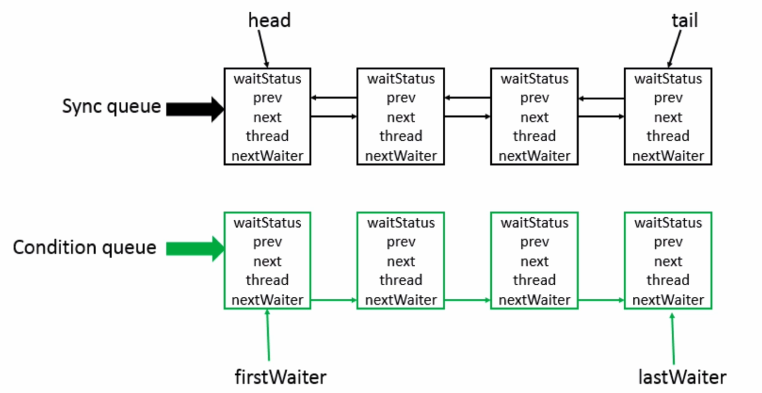
- 子类通过继承并通过实现它的方法管理其状态（acquire 和 release）方法操作状态
- 可以同时实现排它锁和共享锁模式（独占、共享）
### 2、AQS同步组件
- CountDownLatch（闭锁）
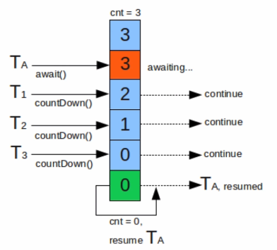
应用场景：
    比如，想要计算邻接表里的节点个数，每条链表拥有自己的线程进行计算，最后汇总，这样就会提高了统计速度
    说白了，一个线程等待其他一个或者几个线程完成后才执行
  
- Semaphore（计数信号量）
应用场景：
    Semaphore可以用于做流量控制，特别公用资源有限的应用场景，
    比如数据库连接。假如有一个需求，要读取几万个文件的数据，因为都是IO密集型任务，我们可以启动几十个线程并发的读取，
    但是如果读到内存后，还需要存储到数据库中，而数据库的连接数只有10个，这时我们必须控制只有十个线程同时获取数据库连接保存数据，
    否则会报错无法获取数据库连接。这个时候，我们就可以使用Semaphore来做流控
  
- CyclicBarrier

  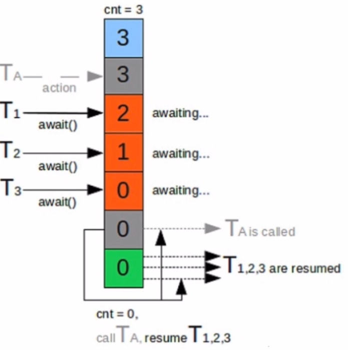

- ReentrantLock
    - 可以指定是公平锁还是非公平锁
    - 提供一个Condition类，可以分组唤醒需要唤醒的线程
    - 提供能够中断等待锁的机制，lock.lockInterruptibly()
- Condition

- FutureTask

## 六、JUC组件拓展
## 七、线程调度-线程池
## 八、多线程并发拓展
## 九、高并发之扩容思路
## 十、高并发之缓存思路
## 十一、高并发之消息队列思路
- 消息队列的好处
    - 业务解耦
    - 最终一致性
    - 广播
    - 错峰与流控
## 十二、高并发之应用拆分思路
-  原则
    - 业务优先
    - 循序渐进
    - 重构、分层
    - 可靠测试（每一步都要有足够的测试）
- 思考
    - 应用之间通信：RPC（Dubbo）、消息队列
    - 每个应用都有自己独立的数据库
    - 避免事务操作跨应用
- 应用拆分
    - 服务化 Dubbo
    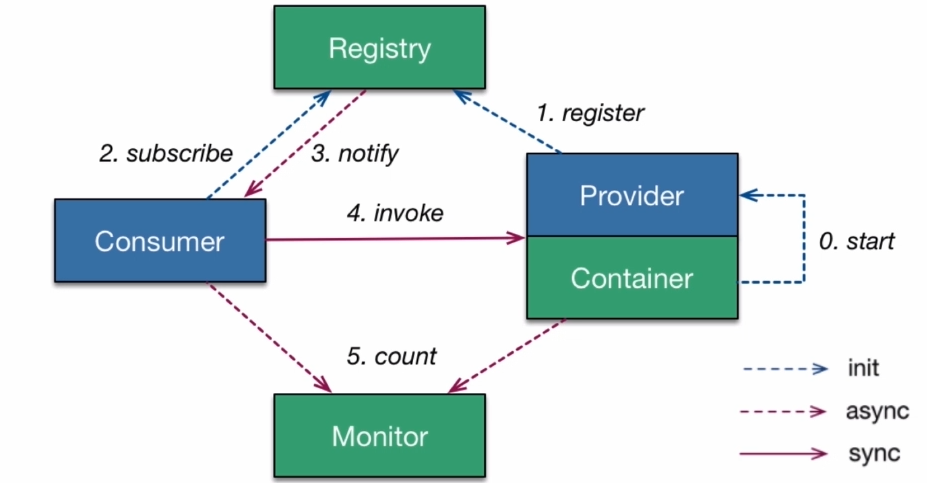
    - 微服务 Spring Cloud
    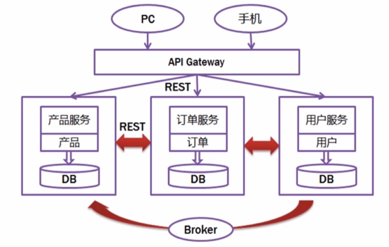
    
## 十三、高并发之应用限流思路
- 背景
限制一段时间内通过的流量
- 限流算法
    - 计数器法
    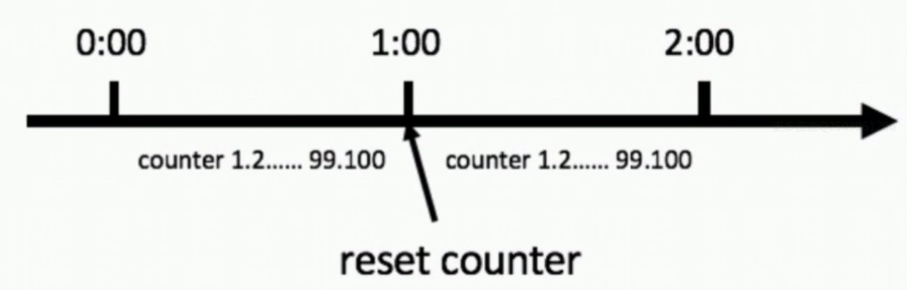
    - 滑动窗口法
    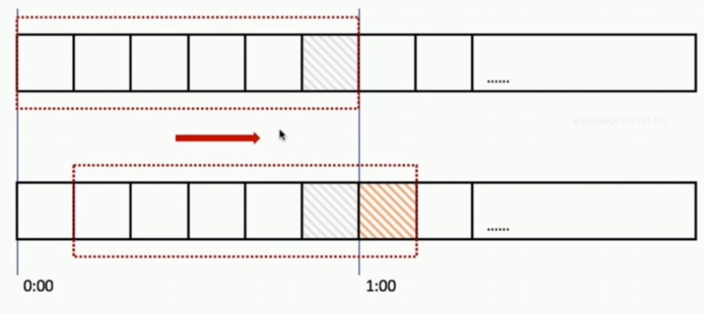
    - 漏桶算法（Leaky Bucket）
    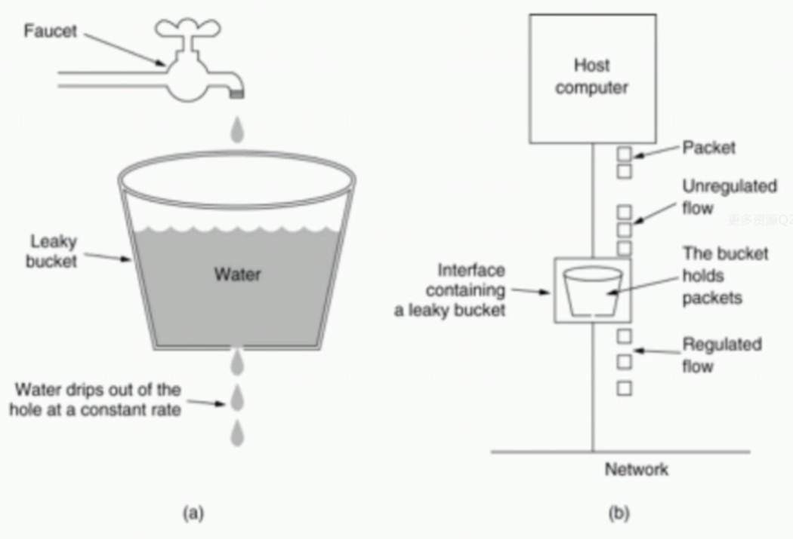
    - 令牌桶算法（Token Bucket）
    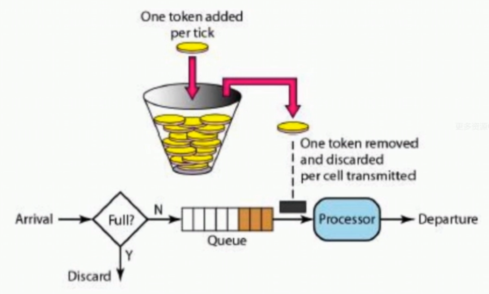
## 十四、高并发之服务降级与服务熔断思路
- 服务降级
    - 服务降级分类
        - 自动降级：超时、失败次数、故障、限流
        - 人工降级：秒杀、大促销
- 服务熔断
## 十五、高并发之数据库切库分库分表思路
- 分表策略方案（mybatis 分表插件 shardbatis2.0）
    - 横向分表
    - 纵向分表
## 十六、高并发之高可用手段
- 任务调度系统分布式：elastic-job + zookeeper
- 主备切换：Apache curator + zookeeper 分布式锁实现
- 监控报警机制
## 十七、课程总结
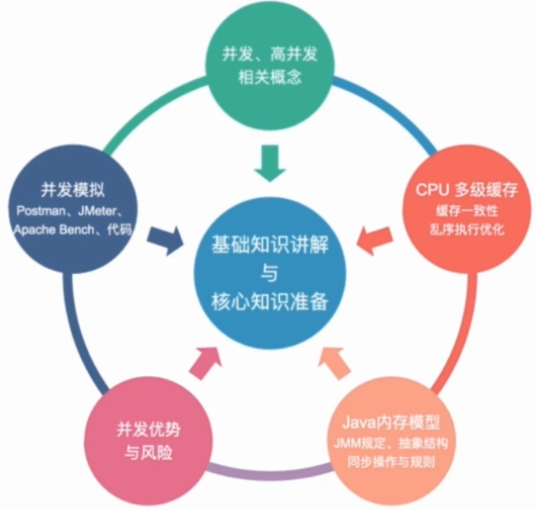
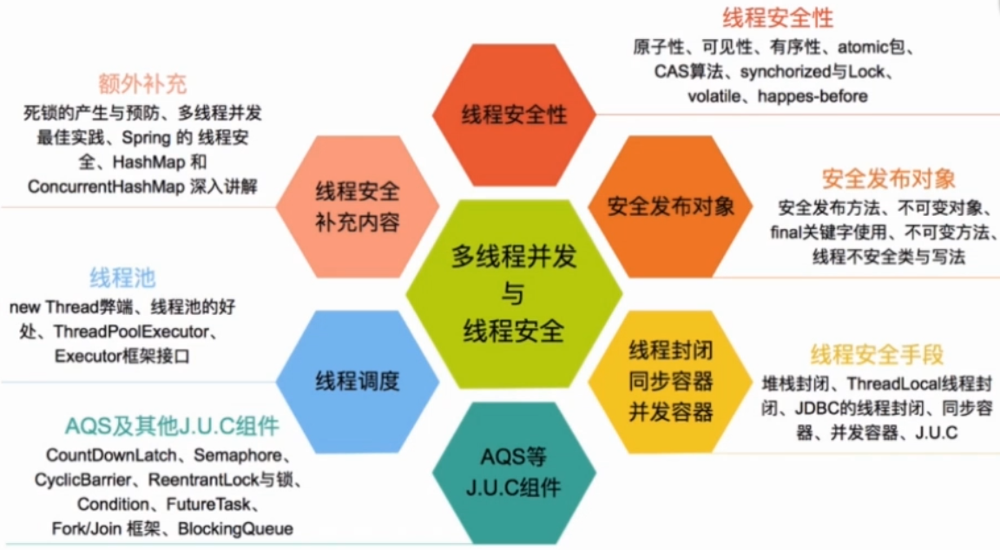
