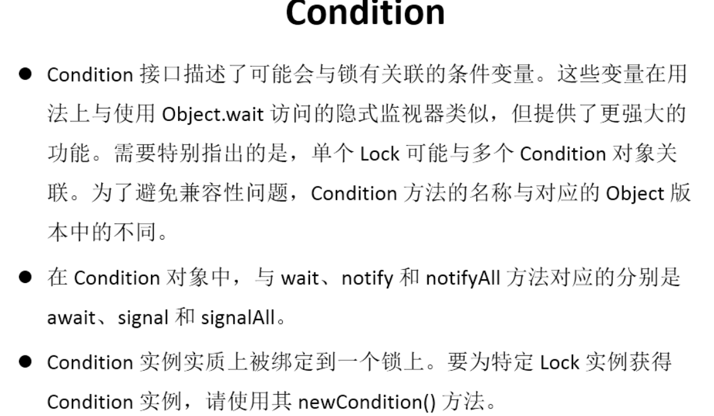

# JUC
## 一、Java JUC简介
在 jdk1.5 提供 java.util.concurrent(简称JUC)包，在此包中添加了在并发编程中很常用的使用工具类，用于定义类似线程的自定义子系统，
包括线程池，异步 IO 和轻量级任务框架。提供可调的、灵活的线程池。还提供了设计用于多线程上下午的Collection 实现等。
## 二、volatile 关键字 - 内存可见性（数据共享没有延迟）
    当多个线程进行操作共享时，可以保证内存中的数据可见。
    相比于 synchronize 是一种 轻量级的同步策略
    理解：
        原来是每个线程都会将 主存 中 的数据缓存到自己线程用进行操作然后刷新到主存中，
        使用volatile就可以简单的看成各个线程不缓存，而是直接对主存里的数据直接进行操作，从而保证了各个线程之间对共享数据的可见性
    注意点：
        1、volatile 不具备互斥性 （相比于 synchronize）
        2、volatile 不能保证变量的“原子性”（原子性：数据的不可拆分）
            
## 三、原子变量 -CAS 算法
原子变量：jdk1.5 后[jdk1.5 后java.util.concurrent.atomic](https://docs.oracle.com/javase/8/docs/api/java/util/concurrent/atomic/package-summary.html) 包下提供常用的原子变量
- 1.volatile 保证 内存可见性
- 2.CAS (Compare-And-Swap)算法保证数据的原子性
```text
        CAS 算法 是 硬件对于 并发操作共享数据的支持
        CAS 包含三个操作数
            需要读写的内存值   内存值 V
            进行比较的值      预估值 A
            拟写入的新值      更新值 B
            当且仅当 V == A 时，进行 V = B ，否则，将不做任何操作
```
        
## 四、ConcurrentHashMap 锁分段机制
- [](./image/ConcurrentHashMap.png)
- CopyOnWriteArrayList/CopyOnWriteArraySet
    注意：
        添加操作多时，效率低。因为每次添加都会进行复制，开销非常大。并发迭代操作多少可以选择。
        
## 五、CountDownLatch闭锁
闭锁，在完成某些运算时，只有其他所有线程的运算全部完成，当且运算才继续执行
以这个为例子：
    如果不采用闭锁的话，加上 main线程，6个线程同时进行，但是这段代码的目的是想求所有线程完成后的时间
    使用 闭锁 等待子线程全部完成后 再 执行
```java
public static void main(String[] args) {
        final int number = 5;
        // 初始化 锁的数量 number
        final CountDownLatch countDownLatch = new CountDownLatch(number);
        LatchDemo latchDemo = new LatchDemo(countDownLatch);

        long start = Instant.now().toEpochMilli();

        for (int i = 0; i < number; i++) {
            new Thread(latchDemo).start();
        }

        try {
            // 闭锁等待 线程完成后，执行
            countDownLatch.await();
        } catch (InterruptedException e) {
            e.printStackTrace();
        }

        long end = Instant.now().toEpochMilli();

        System.out.println("耗时间为：" + (end - start));
    }
```

## 六、实现Callable 接口
- 创建 执行线程的方式三：
    实现Callable 接口，比较与 Runable 接口的方式，==方法可以有返回值，并且可以抛出异常==
- 执行 Callable 方式，需要FutureTask 实现类的支持，用于接收运算结果
```java
public class TestCallable {
    public static void main(String[] args) {
        ThreadCallableDemo threadCallableDemo = new ThreadCallableDemo();
        // 执行 Callable 方式，需要FutureTask 实现类的支持，用于接收运算结果
        FutureTask<Integer> result = new FutureTask<>(threadCallableDemo);
        new Thread(result).start();

        try {
            // FutureTask 可以用于 闭锁
            Integer sum = result.get();
            System.out.println(sum);
            System.out.println("-----------------------------------------");
        } catch (InterruptedException e) {
            e.printStackTrace();
        } catch (ExecutionException e) {
            e.printStackTrace();
        }
    }
}

class ThreadCallableDemo implements Callable<Integer> {

    @Override
    public Integer call() throws Exception {
        int sum = 0;
        for (int i = 0; i < 100; i++) {
            sum += i;
            System.out.println(i);
        }
        return sum;
    }
}
```
    
## 七、Lock同步锁
- 用于解决 多线程安全问题的方式
    - 同步代码块 （synchronized）隐式锁
    - 同步方法 （synchronized）隐式锁
    - 同步锁 Lock（jdk1.5后）
        注意：是一个显示锁，需要通过Lock() 方法上锁，必须通过unlock() 方法进行释放锁
## 八、Condition 控制线程通信

## 九、线程八锁
```text
 * 题目：判断打印的 one or two
 * 1、两个普通同步方法，两个线程，标准打印         one Two
 * 2、新增Thread.sleep() 给 getOne            one Two
 * 3、新增普通方法getThree()                   one Two
 * 4、两个普通同步方法，两个Number 对象           tow one
 * 5、修改getOne() 为静态同步方法，一个Number对象 one tow
 * 6、修改两个方法均为静态同步方法，一个Number 方法 one two
 * 7、一个静态方法，一个非静态方法，两个Number对象  Two one
 * 8、两个静态同步方法，两个Number对象            one Two
 * 线程八锁小结：
 *  1、费静态方法的锁默认为 this，静态方法的锁为 对应的Class 实例
 *  2、某一时刻内，只能有一个线程持有锁，无论 几个方法
```
## 十、线程按序交换
## 十一、ReadWriteLock 读写锁
ReadWriteLock:读写锁
- 写写/读写 需要互斥
- 读读不需要互斥
## 十二、线程池
```text
 * 一、线程池：提供一个线程队列，线程中保存着所有等待状态的线程，避免创建与销毁额外开销，提高了响应的速度
 *
 * 二、线程池的体系结构
 *  java.util.concurrent.Executor：负责线程的使用和调度
 *      |--** ExecutorService 子接口：线程池的主要接口
 *          |--ThreadPoolExecutor：线程池的实现类
 *          |--ScheduleExecutorService：子接口：负责线程池的调度
 *              |-- ScheduledThreadPoolExecutor：继承ThreadPoolExecutor，实现ScheduledExecutorService
 * 三、工具类：Executors
 * ExecutorService newFixedThreadPool() :创建固定大小的线程池
 * ExecutorService newCachedThreadPool() :缓存线程池，线程池的数量不固定，可以根据需求自动的更改数量
 * ExecutorService new SingleThreadExecutor() :创建单个线程池，线程池里只有一个线程
 *
 * ScheduledExecutorService newScheduledThreadPool() :创建固定大小的线程，可以延迟定时或定时的执行任务
```
例子：
```java
    public static void main(String[] args) throws ExecutionException, InterruptedException {
        final int number = 5;
        // 创建线程池
        ExecutorService pool = Executors.newFixedThreadPool(number);

        for (int i = 0; i < number * 10; i++) {
            // 给线程池分配任务
            Future<Integer> future = pool.submit(() -> {
                int sum = 0;
                for (int j = 0; j < 10; j++) {
                    sum += j;
                }
                System.out.println(Thread.currentThread().getName());
                System.out.println("-------------------------------------------------");
                return sum;
            });
            System.out.println(future.get());
        }
        // 关闭线程池
        pool.shutdown();
    }
```
## 十三、线程调度
```java
    public static void main(String[] args) throws ExecutionException, InterruptedException {
        final int number = 5;
        ScheduledExecutorService pool = Executors.newScheduledThreadPool(number);
        for (int j = 0; j < number; j++) {
            ScheduledFuture<Integer> schedule = pool.schedule(() -> {
                int sum = 0;
                int random = (int) (Math.random() * 1000);
                for (int i = 0; i < random; i++) {
                    sum += i;
                }
                return sum;
            }, 2000, TimeUnit.MILLISECONDS);
            System.out.println(schedule.get());
        }
        pool.shutdown();
    }
```
## 十四、ForkJoinPool 分支、合并 框架工作窃取